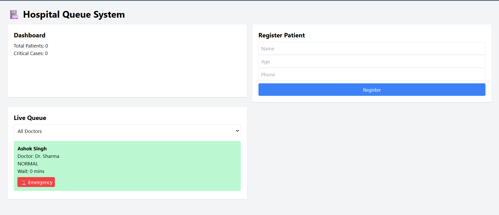
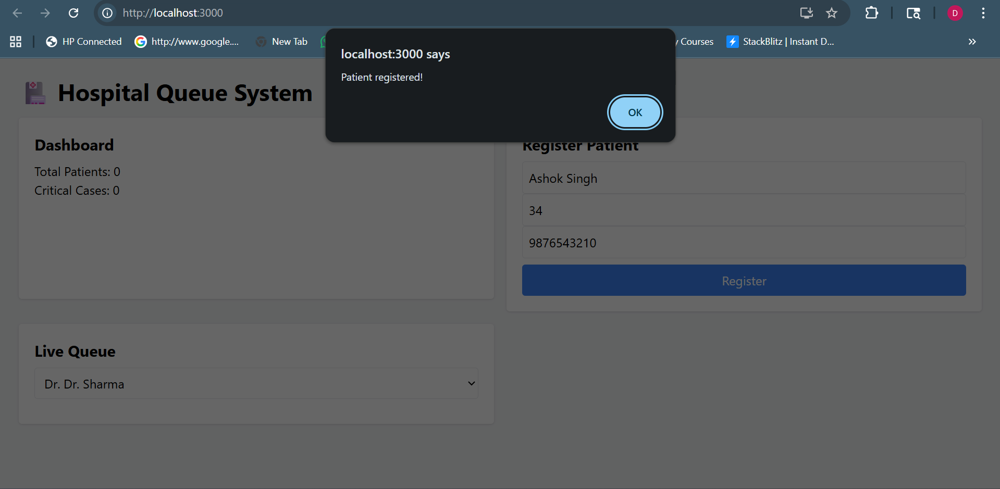
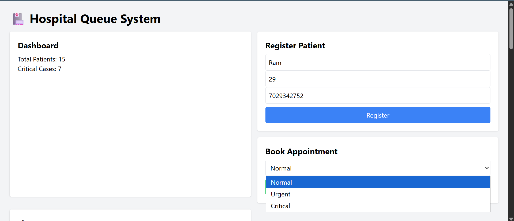
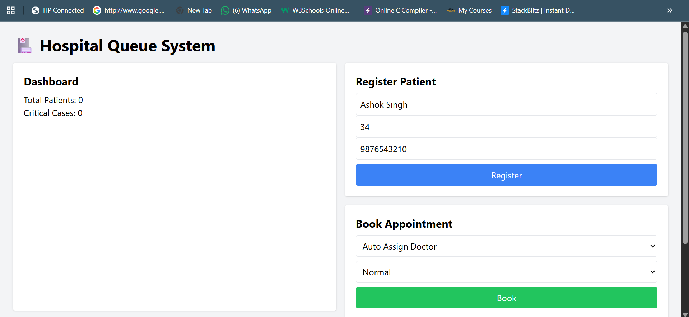
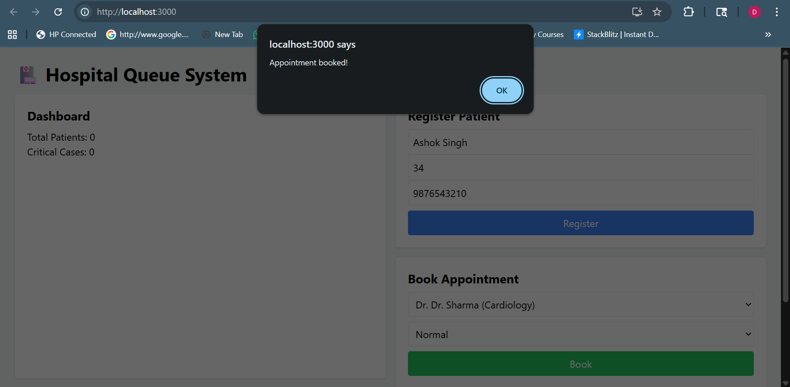

# 🏥 Hospital Queue Management System

## 🚀 Tech Stack

* Frontend: React.js
* Backend: Spring Boot
* Database: MySQL

---

## ✨ Features

* Patient Registration
* Appointment Booking
* Priority Queue (Normal, Urgent, Critical)
* Emergency Fast-Track 🚨
* Smart Doctor Assignment
* Real-time Queue Updates

---

## 📸 Screenshots

### 🏠 Landing Page



---

### 📝 Patient Registration



---

### 📅 Book Appointment





---

## 📂 Project Structure

* `/backend` → Spring Boot API
* `/frontend` → React UI

---

## ▶️ How to Run

### 🔹 Backend

* Open in Eclipse
* Run `SpringbootFirstAppApplication.java`

---

### 🔹 Frontend

```bash
cd frontend
npm install
npm start
```

---

## 💡 Future Improvements

* Admin Dashboard
* Charts & Analytics
* Authentication System
* Notifications System

---

## 👨‍💻 Author

**Diptadeep Sinha**
